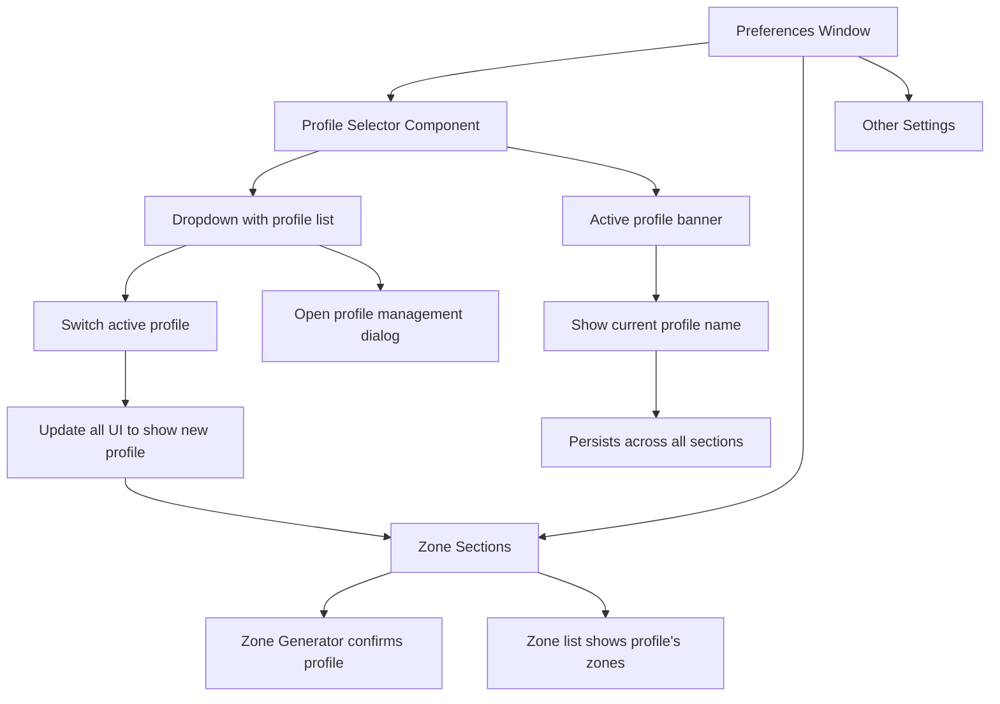

# Profile Selection UI Enhancement Plan

## Problem Statement

Users can create multiple profiles for different zone configurations, but it is **not obvious** how to:
1. **Select** a profile for use
2. **Understand which profile** is currently active
3. **Know that zones are per-profile** and not global settings

---

## Current Issues

| Issue | Location | Impact |
|-------|----------|--------|
| Profile selector shows only text "Active Profile: Default" | `prefs.js:441-444` | No visual prominence |
| Profile list items are plain text rows | `prefs.js:496-513` | Active profile only has subtle checkmark |
| No header/banner indicating which profile is being edited | Throughout zones section | User doesn't know which profile's zones they're modifying |
| Zone Generator saves to global config, not active profile | `prefs.js:947` | Inconsistent behavior |
| Profile switch requires clicking a row in a list | `prefs.js:504-512` | Non-intuitive interaction |
| No visual grouping/section indicating "these settings are for profile X" | Entire preferences window | Context lost |

---

## Design Solution

### Visual Hierarchy

```
┌─────────────────────────────────────────────────────────────────┐
│  ┌───────────────────────────────────────────────────────────┐  │
│  │ 📁 PROFILE: Work (Active)                              ▼ │  │
│  │ "Zones and settings for your Work configuration"          │  │
│  └───────────────────────────────────────────────────────────┘  │
│                                                                  │
│  [Zone Editor]  [Tab Appearance]  [Tab Behavior]  [Exclusions]   │
└─────────────────────────────────────────────────────────────────┘
```

### Key UI Changes

#### 1. Prominent Profile Selector Header

Replace the simple "Active Profile" row with a **prominent card/banner**:

```xml
┌─────────────────────────────────────────────────────────────────┐
│ 📁  Active Profile: <b>Work</b>                            ▼   │
│    Click to switch profiles or manage them                       │
└─────────────────────────────────────────────────────────────────┘
```

- **Bold profile name** for visual prominence
- **Dropdown arrow** indicating it's clickable
- **Subtitle** explaining what profiles do
- **Dropdown menu** showing all profiles with checkmark on active
- **"Manage Profiles..."** option at bottom

#### 2. Profile-Context Banner Above Zone Sections

Add a persistent banner that appears above any zone-related section:

```
┌─────────────────────────────────────────────────────────────────┐
│ ⚠️  Editing zones for profile: <b>Work</b>                      │
│    These zones will be used when "Work" is the active profile   │
└─────────────────────────────────────────────────────────────────┘
```

#### 3. Clearer Profile List with Visual States

```
┌────────────────────────────────────┐
│ ●  Default                    [✓] │
│ ○  Work (current)             [✓] │
│ ○  Gaming                          │
├────────────────────────────────────┤
│  [+ New Profile]                   │
└────────────────────────────────────┘
```

- **Radio-button style selection** (●/○) instead of click-any-row
- **Explicit "(current)" label** for active profile
- **Active profile checkmark** more visible
- **Profile list in a styled card** with rounded corners

#### 4. Zone Generator Confirmation

When Zone Generator runs, show which profile will be affected:

```
┌─────────────────────────────────────────────────────────────────┐
│ ✓ Generated 3 zones for Monitor 0 (Work profile)                 │
└─────────────────────────────────────────────────────────────────┘
```

---

## Implementation Architecture



---

## Component Design

### New Component: ProfileSelectorCard

**Location:** `prefs.js` (new widget class)

**Properties:**
- `activeProfile`: Current profile name
- `onProfileChanged`: Callback when user selects different profile
- `onManageProfiles`: Callback to open profile management dialog

**States:**
- Default: Shows profile name with dropdown arrow
- Hover: Highlight background
- Open: Dropdown menu visible with all profiles
- Loading: Spinner while switching profiles

### New Component: ProfileContextBanner

**Location:** `prefs.js` (new widget class)

**Properties:**
- `profileName`: Name of profile being edited
- `visible`: Whether to show the banner

**Appearance:**
- Warning-style background (subtle orange/yellow)
- Icon + text indicating profile context
- Appears only above zone-related sections

---

## File Structure Changes

### prefs.js Changes

| Line(s) | Change | Description |
|---------|--------|-------------|
| 430-476 | REPLACE | Replace simple profile selector with ProfileSelectorCard |
| 621-709 | MODIFY | Add ProfileContextBanner above Zone Generator and Zones sections |
| 656-658 | MODIFY | Load zones from active profile instead of global config |
| 660-708 | MODIFY | Zone Generator shows profile name in confirmation |
| 947-956 | MODIFY | Save zones to active profile (already done), confirm with profile name |

### New Functions in prefs.js

```javascript
// Profile selector component
class ProfileSelectorCard extends Adw.Bin { ... }

// Context banner component  
class ProfileContextBanner extends Adw.Bin { ... }

// Profile management dialog
class ProfileManagementDialog extends Adw.Dialog { ... }
```

---

## User Flow

### Scenario 1: User opens preferences for first time

1. **System loads** `profiles.json` → finds "Default" as active
2. **Preferences window opens** with:
   - ProfileSelectorCard showing "Default (Active)"
   - ProfileContextBanner showing "Editing zones for profile: Default"
   - Zone list populated from `profiles/Default/zones.json`

### Scenario 2: User switches to a different profile

1. User clicks ProfileSelectorCard dropdown
2. Selects "Work" from list
3. **System calls** `setActiveProfile("Work")`
4. **UI updates:**
   - ProfileSelectorCard updates to show "Work (Active)"
   - ProfileContextBanner updates to "Work"
   - Zone list reloads from `profiles/Work/zones.json`
5. **Extension receives** 'profile-changed' signal → reloads zones

### Scenario 3: User creates a new profile and edits zones

1. User clicks "Manage Profiles..." in dropdown
2. Dialog opens with profile list + Create/Rename/Delete buttons
3. User clicks "New Profile", enters "Gaming", clicks Create
4. Dialog closes, ProfileSelectorCard updates to "Gaming (Active)"
5. User edits zones → zones saved to `profiles/Gaming/zones.json`

---

## Backward Compatibility

- Existing `profiles.json` structure unchanged
- Existing profile directories and `zones.json` files unchanged
- Global `config.json` still exists for non-zone settings
- Migration: On first load, if no profiles exist, create "Default" (already done)

---

## Testing Checklist

- [ ] Profile selector shows active profile correctly
- [ ] Clicking profile in dropdown switches active profile
- [ ] Zones list updates when profile changes
- [ ] New profile creation works and immediately becomes active
- [ ] Profile rename updates selector and banner
- [ ] Profile delete switches to remaining profile if active deleted
- [ ] Zone Generator confirms which profile will be modified
- [ ] Save button saves to correct profile
- [ ] Extension receives profile change signal and reloads zones

---

## Implementation Order

1. **Create ProfileSelectorCard component** - Dropdown with profile list, styled nicely
2. **Create ProfileContextBanner component** - Warning-style banner
3. **Replace profile selector UI** - Swap old row for new card
4. **Add context banner** - Insert above zone sections
5. **Fix zone loading** - Load zones from active profile on open
6. **Add profile indicator to Zone Generator** - Show profile name in confirmation
7. **Add profile management dialog** - Dedicated dialog for CRUD operations
8. **Test full flow** - Create/switch/edit/save profiles end-to-end