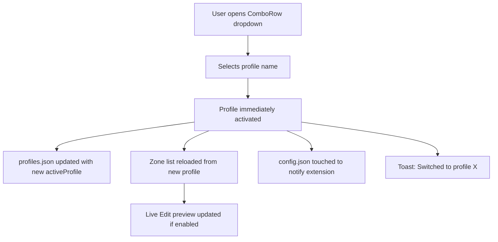
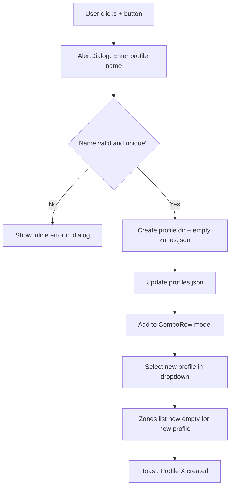
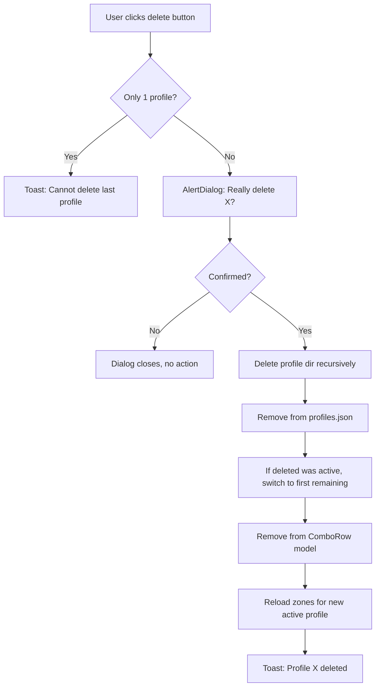

# Settings UI Revamp — Design Document

## Overview

This document defines the complete redesign of the Tabbed Tiling GNOME Shell extension preferences window. The current `prefs.js` is a ~1960 line monolithic file with a single `fillPreferencesWindow()` function spanning ~730 lines. The redesign targets:

- **Better visual structure** — 4 logical pages instead of 2
- **Auto-save** — eliminate manual save buttons, persist on change
- **Improved UX** — proper keybinding editing, tag-based exclusions, immediate profile activation
- **Clean architecture** — modular page builders, reusable widget helpers
- **GNOME HIG compliance** — consistent use of Adw widgets and patterns

---

## New Page Structure

```
┌──────────────────────────────────────────────────────────────────────┐
│  Tabbed Tiling Preferences                                            │
├──────────┬───────────────┬────────────────────┬──────────────────────┤
│ Profiles │  Appearance   │  Behavior          │  About               │
│ & Zones  │               │  & Shortcuts       │                      │
└──────────┴───────────────┴────────────────────┴──────────────────────┘
```

### Page 1: Profiles & Zones
**Icon:** `view-grid-symbolic`

| Group | Contents |
|-------|----------|
| Profile Selector | ComboRow + CRUD action buttons in header suffix |
| Zone Generator | ExpanderRow with 6 SpinRows + Generate button |
| Zones | Live Edit toggle + Add button + list of ZoneEditorRow widgets |

### Page 2: Appearance
**Icon:** `applications-graphics-symbolic`

| Group | Contents |
|-------|----------|
| Colors | 4 color pickers: bar background, active tab, global active tab, group border |
| Dimensions | 6 SpinRows: height, corner radius, icon size, font size, spacing, max width, close button size |

### Page 3: Behavior & Shortcuts
**Icon:** `preferences-system-symbolic`

| Group | Contents |
|-------|----------|
| Tab Behavior | 4 ComboRows: title source, grouping criteria, sorting criteria, sorting order |
| Keyboard Shortcuts | 3 editable keybinding rows bound to GSettings |
| Exclusions | ComboRow for criteria + ListBox of exclusion entries with add/remove |

### Page 4: About
**Icon:** `help-about-symbolic`

| Group | Contents |
|-------|----------|
| Extension Info | Adw.StatusPage with icon, version, description |
| Links | GitHub repo link, bug report link |
| Debug | Reset to defaults button, export all settings button |

---

## Detailed Widget Specifications

### Page 1: Profiles & Zones

#### Profile Selector Group

```
┌─ Profile ─────────────────────────────────────────────────────────────┐
│ "Select a profile to load its zone layout"                            │
│                                                                        │
│ ┌──────────────────────────────────────────────────────────────────┐  │
│ │ Active Profile          [Default           ▾]  [+] [⟳] [⤓] [🗑] │  │
│ └──────────────────────────────────────────────────────────────────┘  │
│                                                                        │
│ ┌──────────────────────────────────────────────────────────────────┐  │
│ │ Duplicate Profile       Creates a copy of the current profile     │  │
│ └──────────────────────────────────────────────────────────────────┘  │
│ ┌──────────────────────────────────────────────────────────────────┐  │
│ │ Import Profile          Import zones from a JSON file        [📂] │  │
│ └──────────────────────────────────────────────────────────────────┘  │
│ ┌──────────────────────────────────────────────────────────────────┐  │
│ │ Export Profile          Export current profile to file        [💾] │  │
│ └──────────────────────────────────────────────────────────────────┘  │
└────────────────────────────────────────────────────────────────────────┘
```

**Widget choices:**
- `Adw.ComboRow` — profile dropdown (selecting immediately activates the profile)
- Suffix buttons: New (`list-add-symbolic`), Rename (`document-edit-symbolic`), Import (`document-open-symbolic`), Delete (`user-trash-symbolic`)
- `Adw.ActionRow` with button suffix — Duplicate, Import, Export

**Behavior:**
- Selecting a profile in the ComboRow **immediately activates** it (no separate Load button)
- The extension is notified via config.json touch (existing mechanism)
- Zone list below reloads automatically
- Delete shows `Adw.AlertDialog` confirmation
- New shows `Adw.AlertDialog` with entry field

#### Zone Generator Group

```
┌─ Zone Generator ──────────────────────────────────────────────────────┐
│ "Quickly create evenly-split horizontal zones for a monitor"          │
│                                                                        │
│ ┌──────── ▶ Generator Settings ───────────────────────────────────┐  │
│ │  Monitor Index                                            [0  ] │  │
│ │  Resolution Width                                         [1920] │  │
│ │  Resolution Height                                        [1080] │  │
│ │  Start X                                                  [0   ] │  │
│ │  Start Y                                                  [0   ] │  │
│ │  Number of Zones                                          [2   ] │  │
│ │                                                                  │  │
│ │                    [ Generate Zones ]                             │  │
│ └──────────────────────────────────────────────────────────────────┘  │
└────────────────────────────────────────────────────────────────────────┘
```

**Widget choices:**
- `Adw.ExpanderRow` — collapsed by default to save vertical space
- 6x `Adw.SpinRow` — one for each parameter (native Adw widget, cleaner than ActionRow+SpinButton)
- `Gtk.Button` with `suggested-action` class — Generate

**Behavior:**
- Generate shows `Adw.AlertDialog`: "This will replace all zones for Monitor X in profile Y. Continue?"
- On confirm: generates zones, auto-saves to profile, triggers live preview
- Generator settings are persisted to `config.json.zoneGenerator` on change (auto-save)

#### Zones Group

```
┌─ Zones ───────────────────────────────────────────────────────────────┐
│ "Define rectangles for window snapping and tabbing"                    │
│                                                                        │
│ ┌──────────────────────────────────────────────────────────────────┐  │
│ │ Live Edit           Show real-time overlays while editing    [⏻] │  │
│ └──────────────────────────────────────────────────────────────────┘  │
│ ┌──────────────────────────────────────────────────────────────────┐  │
│ │ Add Zone                                                   [+]  │  │
│ └──────────────────────────────────────────────────────────────────┘  │
│                                                                        │
│ ┌──── ▶ Monitor 0 Zone 1  —  X:0 Y:0 W:960 H:1080 ──────────────┐  │
│ │  Name                                    [Monitor 0 Zone 1    ] │  │
│ │  ── Position ──                                                 │  │
│ │  Monitor Index                                            [0  ] │  │
│ │  X                          ═══════════●═══           [0      ] │  │
│ │  Y                          ●════════════════         [0      ] │  │
│ │  ── Size ──                                                     │  │
│ │  Width                      ═════════●═══════         [960    ] │  │
│ │  Height                     ═══════════════●=         [1080   ] │  │
│ │  ── Gaps ──                                                     │  │
│ │  Top                                                      [8  ] │  │
│ │  Right                                                    [8  ] │  │
│ │  Bottom                                                   [8  ] │  │
│ │  Left                                                     [8  ] │  │
│ │  ── Options ──                                                  │  │
│ │  Primary Zone                                              [⏻] │  │
│ │                                                                  │  │
│ │                                   [ Remove Zone ]                │  │
│ └──────────────────────────────────────────────────────────────────┘  │
│                                                                        │
│ ┌──── ▶ Monitor 0 Zone 2  —  X:960 Y:0 W:960 H:1080 ────────────┐  │
│ │  ...                                                             │  │
│ └──────────────────────────────────────────────────────────────────┘  │
└────────────────────────────────────────────────────────────────────────┘
```

**Widget choices:**
- `Adw.SwitchRow` — Live Edit toggle
- `Adw.ActionRow` + suffix button — Add Zone
- `Adw.ExpanderRow` — each zone (collapsed by default)
- Inner fields organized with `Adw.PreferencesGroup` separators (or visual GroupHeaders using bold ActionRows)
- Position/Size: `Adw.ActionRow` with `Gtk.Scale` + `Gtk.SpinButton` + reset button as suffix (existing pattern, works well)
- Gaps: 4x `Adw.SpinRow` (simpler, no slider needed for small values)
- Primary Zone: `Adw.SwitchRow`
- Remove: `Gtk.Button` with `destructive-action` class

**Behavioral improvements:**
- Zone subtitle auto-updates showing position/size
- Changes auto-save after 500ms debounce
- Live Edit preview fires on every change (existing 50ms debounce)
- Boundary clamping validated with visual error CSS class on overflow
- Remove button shows confirmation only if zone has non-default values

---

### Page 2: Appearance

#### Colors Group

```
┌─ Colors ──────────────────────────────────────────────────────────────┐
│ "Configure tab bar colors and opacity"                                │
│                                                                        │
│ ┌──────────────────────────────────────────────────────────────────┐  │
│ │ Tab Bar Background       Pick color and opacity          [████] │  │
│ │ Active Tab Color         Focused tab in zone             [████] │  │
│ │ Global Active Tab Color  Window with keyboard focus      [████] │  │
│ │ Group Border Color       Border for grouped tabs         [████] │  │
│ └──────────────────────────────────────────────────────────────────┘  │
└────────────────────────────────────────────────────────────────────────┘
```

**Widget choices:**
- 4x `Adw.ActionRow` with `Gtk.ColorDialogButton` suffix (existing pattern, GTK4-native)

#### Dimensions Group

```
┌─ Dimensions ──────────────────────────────────────────────────────────┐
│ "Size and spacing of tab bar elements"                                │
│                                                                        │
│ ┌──────────────────────────────────────────────────────────────────┐  │
│ │ Tab Bar Height                                        [32  ] px │  │
│ │ Tab Corner Radius                                     [8   ] px │  │
│ │ Icon Size                                             [16  ] px │  │
│ │ Font Size                                             [10  ] pt │  │
│ │ Tab Spacing                                           [4   ] px │  │
│ │ Max Tab Width                                         [250 ] px │  │
│ │ Close Button Size                                     [12  ] px │  │
│ └──────────────────────────────────────────────────────────────────┘  │
└────────────────────────────────────────────────────────────────────────┘
```

**Widget choices:**
- 7x `Adw.SpinRow` — native Adw spin row with built-in label, adjustment, subtitle support
- Each SpinRow has appropriate min/max/step (see table below)

| Setting | Min | Max | Step | Default |
|---------|-----|-----|------|---------|
| Height | 16 | 256 | 1 | 32 |
| Corner Radius | 0 | 32 | 1 | 8 |
| Icon Size | 8 | 48 | 1 | 16 |
| Font Size | 6 | 24 | 1 | 10 |
| Tab Spacing | 0 | 32 | 1 | 4 |
| Max Tab Width | 50 | 1000 | 10 | 250 |
| Close Button Size | 8 | 32 | 1 | 12 |

---

### Page 3: Behavior & Shortcuts

#### Tab Behavior Group

```
┌─ Tab Behavior ────────────────────────────────────────────────────────┐
│ "Configure how tabs are labeled, grouped, and sorted"                 │
│                                                                        │
│ ┌──────────────────────────────────────────────────────────────────┐  │
│ │ Tab Title Source                    [Window Title         ▾]     │  │
│ │ Grouping Criteria                   [Application Name    ▾]     │  │
│ │ Sorting Criteria                    [Window Title         ▾]     │  │
│ │ Sorting Order                       [Ascending           ▾]     │  │
│ └──────────────────────────────────────────────────────────────────┘  │
└────────────────────────────────────────────────────────────────────────┘
```

**Widget choices:**
- 4x `Adw.ComboRow` — native dropdown with model (replaces ActionRow+DropDown)
- Each has a `subtitle` explaining the effect

| ComboRow | Options | Config Key |
|----------|---------|------------|
| Tab Title Source | Window Title, Application Name, WM_CLASS | `tabBar.titleSource` |
| Grouping Criteria | Application Name, WM_CLASS | `tabBar.groupingCriteria` |
| Sorting Criteria | Window Title, Application Name, WM_CLASS | `tabBar.sortingCriteria` |
| Sorting Order | Ascending, Descending | `tabBar.sortingOrder` |

#### Keyboard Shortcuts Group

```
┌─ Keyboard Shortcuts ──────────────────────────────────────────────────┐
│ "Customize keyboard shortcuts for tiling actions"                     │
│                                                                        │
│ ┌──────────────────────────────────────────────────────────────────┐  │
│ │ Cycle Next Tab           [Ctrl+Shift+Right      ]  [Reset]      │  │
│ │ Cycle Previous Tab       [Ctrl+Shift+Left       ]  [Reset]      │  │
│ │ Toggle Tab Bar Layer     [Alt+Q                 ]  [Reset]      │  │
│ └──────────────────────────────────────────────────────────────────┘  │
│                                                                        │
│ ┌──────────────────────────────────────────────────────────────────┐  │
│ │ Tiling Enabled                                             [⏻]  │  │
│ └──────────────────────────────────────────────────────────────────┘  │
└────────────────────────────────────────────────────────────────────────┘
```

**Widget choices:**
- 3x `Adw.ActionRow` with custom keybinding capture button (see Keybinding Editor section)
- `Adw.SwitchRow` for tiling-enabled toggle bound directly to GSettings

**Keybinding Editor Implementation:**

Use a custom widget pattern common in GNOME extensions:

```javascript
// KeybindingRow: ActionRow with a button that enters capture mode
// - Normal state: shows accelerator label like Gtk.ShortcutLabel
// - Click button: enters capture mode, shows "Press a key combination..."
// - Capture: listens for keypress via Gtk.EventControllerKey
// - On valid combo: stores to GSettings, exits capture mode
// - Escape: cancels capture
// - Backspace: clears binding (sets to disabled)
// - Reset button: restores GSettings default
```

This pattern reads/writes directly to the GSettings schema keys (`cycle-next-tab`, `cycle-prev-tab`, `log-key-press`) which are `type="as"` (array of strings in accelerator format).

#### Exclusions Group

```
┌─ Exclusions ──────────────────────────────────────────────────────────┐
│ "Prevent specific applications from being managed by the tiler"       │
│                                                                        │
│ ┌──────────────────────────────────────────────────────────────────┐  │
│ │ Match By                            [WM_CLASS           ▾]      │  │
│ └──────────────────────────────────────────────────────────────────┘  │
│                                                                        │
│ ┌──────────────────────────────────────────────────────────────────┐  │
│ │ Add Exclusion     [_________________________]            [Add]  │  │
│ └──────────────────────────────────────────────────────────────────┘  │
│                                                                        │
│ ┌──────────────────────────────────────────────────────────────────┐  │
│ │ gnome-calculator                                          [✕]   │  │
│ │ Guake                                                     [✕]   │  │
│ │ pavucontrol                                               [✕]   │  │
│ └──────────────────────────────────────────────────────────────────┘  │
└────────────────────────────────────────────────────────────────────────┘
```

**Widget choices:**
- `Adw.ComboRow` — criteria selector (WM_CLASS / Application Name)
- `Adw.EntryRow` with suffix Add button — input for new exclusion
- `Gtk.ListBox` inside `Adw.PreferencesGroup` — list of exclusion items
- Each item: `Adw.ActionRow` with a remove button (`window-close-symbolic`) suffix

**Behavior:**
- Enter key or Add button adds the entry text as a new exclusion
- Remove button removes the entry
- Duplicate entries are prevented (show toast: "Already excluded")
- Changes auto-save immediately
- Empty/whitespace-only entries rejected

---

### Page 4: About

```
┌─ Tabbed Tiling ───────────────────────────────────────────────────────┐
│                                                                        │
│                         ┌──────────┐                                  │
│                         │  🪟 icon │                                  │
│                         └──────────┘                                  │
│                       Tabbed Tiling                                    │
│                        Version 1.0                                     │
│                                                                        │
│           A tiling window manager for GNOME Shell that                │
│         uses tabs to manage windows within predefined zones.          │
│                                                                        │
│                    [ GitHub ]  [ Report Bug ]                          │
│                                                                        │
│ ┌─ Maintenance ───────────────────────────────────────────────────┐  │
│ │                                                                  │  │
│ │  Reset All Settings        Restore factory defaults     [Reset] │  │
│ │  Export All Settings       Save config + profiles to file  [⤓]  │  │
│ │  Import All Settings       Restore from exported file      [⤒]  │  │
│ │                                                                  │  │
│ └──────────────────────────────────────────────────────────────────┘  │
└────────────────────────────────────────────────────────────────────────┘
```

**Widget choices:**
- `Adw.StatusPage` — extension icon, title, description
- `Adw.PreferencesGroup` — Maintenance section
- `Adw.ActionRow` with button suffix — Reset, Export, Import
- Reset: `Adw.AlertDialog` confirmation before proceeding

---

## Auto-Save Strategy

### Principles

1. **No manual save buttons** — all changes persist automatically
2. **Debounced writes** — avoid excessive disk I/O during rapid edits
3. **Visual feedback** — toast notification on save (non-intrusive)
4. **Separation of concerns** — zones save to profile dir, settings save to config.json, keybindings save to GSettings

### Implementation

```
┌─────────────────────────────────────────────────────────────────┐
│                     Auto-Save Pipeline                            │
├─────────────────────────────────────────────────────────────────┤
│                                                                   │
│  Widget Value Changed                                            │
│        │                                                          │
│        ▼                                                          │
│  Debounce Timer (500ms for config, 50ms for live preview)        │
│        │                                                          │
│        ▼                                                          │
│  ┌─────────────┐   ┌──────────────┐   ┌──────────────────────┐  │
│  │ config.json │   │ zones.json   │   │ GSettings            │  │
│  │ tabBar,     │   │ per-profile  │   │ keybindings          │  │
│  │ exclusions, │   │ zone data    │   │ tiling-enabled       │  │
│  │ zoneGen     │   │              │   │ (immediate, no       │  │
│  └──────┬──────┘   └──────┬───────┘   │  debounce needed)    │  │
│         │                  │           └──────────┬───────────┘  │
│         ▼                  ▼                      ▼              │
│  ┌─────────────────────────────────────────────────────────────┐ │
│  │              Adw.Toast: "Settings saved"                     │ │
│  └─────────────────────────────────────────────────────────────┘ │
└─────────────────────────────────────────────────────────────────┘
```

### Debounce Configuration

| Data Type | Debounce | Target File | Trigger |
|-----------|----------|-------------|---------|
| Tab appearance (colors, sizes) | 500ms | `config.json` | SpinRow/ColorButton change |
| Tab behavior (dropdowns) | 0ms (immediate) | `config.json` | ComboRow selection |
| Exclusions | 0ms (immediate) | `config.json` | Add/Remove action |
| Zone edits | 500ms | `profiles/<name>/zones.json` | Any zone field change |
| Zone generator params | 500ms | `config.json` | SpinRow change |
| Keybindings | 0ms (immediate) | GSettings | Key capture complete |
| Tiling enabled | 0ms (immediate) | GSettings | Switch toggle |
| Live preview | 50ms | `preview.json` | Any zone field change |

### Auto-Save Helper Class

```javascript
class AutoSaver {
    constructor(saveFunction, debounceMs = 500) {
        this._save = saveFunction;
        this._debounceMs = debounceMs;
        this._timerId = 0;
    }

    schedule() {
        if (this._timerId) {
            GLib.Source.remove(this._timerId);
        }
        this._timerId = GLib.timeout_add(
            GLib.PRIORITY_DEFAULT, this._debounceMs, () => {
                this._timerId = 0;
                this._save();
                return GLib.SOURCE_REMOVE;
            }
        );
    }

    saveNow() {
        if (this._timerId) {
            GLib.Source.remove(this._timerId);
            this._timerId = 0;
        }
        this._save();
    }

    destroy() {
        if (this._timerId) {
            GLib.Source.remove(this._timerId);
            this._timerId = 0;
        }
    }
}
```

### Toast Strategy

- Show toast on save: brief "✓ Settings saved" (timeout: 2s)
- Suppress duplicate toasts: if a toast is showing, don't queue another
- Show error toast on save failure: "⚠ Failed to save settings" (timeout: 5s)
- Profile switch toast: "Switched to profile: Work" (timeout: 3s)

---

## Profile Management UX Flow

### Selecting a Profile



### Creating a Profile



### Deleting a Profile



### Import/Export

**Export:**
1. User clicks Export button
2. `Gtk.FileDialog` opens in save mode with suggested filename `<profileName>-zones.json`
3. Writes `ProfileManager.exportProfile(name)` JSON to chosen path
4. Toast: "Profile exported successfully"

**Import:**
1. User clicks Import button
2. `Gtk.FileDialog` opens in open mode, filtered to `.json` files
3. File contents parsed — validated to have `zones` array
4. `Adw.AlertDialog`: "Import as new profile? Enter name:"
5. On confirm: creates profile from imported data
6. New profile added to dropdown and selected
7. Toast: "Profile imported as X"

---

## Keybinding Editor Design

### Widget: KeybindingRow

A reusable custom widget that reads/writes GSettings accelerator keys.

```
┌──────────────────────────────────────────────────────────────────┐
│ Cycle Next Tab                                                    │
│ "Switch to the next tab in the current zone"                     │
│                                     [Ctrl+Shift+Right] [↺]       │
└──────────────────────────────────────────────────────────────────┘
```

**States:**

| State | Appearance | Interaction |
|-------|------------|-------------|
| Normal | ShortcutLabel showing current binding | Click label to enter capture |
| Capture | Label shows "Press keys..." with accent background | Any valid keycombo sets binding |
| Capture + Escape | Returns to Normal | Cancels without change |
| Capture + Backspace | Sets "Disabled" | Clears the binding |
| After set | Flash green border briefly | Saves to GSettings immediately |

**Implementation approach:**

```javascript
class KeybindingRow extends Adw.ActionRow {
    _init(settings, key, title, subtitle) {
        // settings: Gio.Settings instance
        // key: GSettings key name like 'cycle-next-tab'
        this._settings = settings;
        this._key = key;

        // ShortcutLabel shows the current accelerator
        this._label = new Gtk.ShortcutLabel({
            accelerator: this._getCurrentAccelerator(),
            disabled_text: 'Disabled',
        });

        // Capture button
        this._captureBtn = new Gtk.Button({ child: this._label });
        // EventControllerKey for capturing
        this._keyController = new Gtk.EventControllerKey();
        // Reset button
        this._resetBtn = new Gtk.Button({ icon_name: 'edit-undo-symbolic' });
    }
}
```

**GSettings binding details:**
- Keys are `type="as"` (string array) in accelerator format like `['<Control><Shift>Right']`
- Read: `settings.get_strv(key)[0]` → parse with `Gtk.accelerator_parse()`
- Write: `settings.set_strv(key, [Gtk.accelerator_name(keyval, mods)])`
- The extension already monitors GSettings changes and re-binds shortcuts

---

## Exclusion Management Design

### Tag-List Pattern

Replace the raw comma-separated text entry with a proper list management UI:

```
┌─ Exclusions ──────────────────────────────────────────────────────────┐
│                                                                        │
│  Match By:   [WM_CLASS  ▾]                                           │
│                                                                        │
│  ┌──────────────────────────────────────────┐  ┌─────┐               │
│  │ Type app name or WM_CLASS...             │  │ Add │               │
│  └──────────────────────────────────────────┘  └─────┘               │
│                                                                        │
│  ┌────────────────────────────────────────────────────────────────┐  │
│  │  gnome-calculator                                         [✕]  │  │
│  │  Guake                                                    [✕]  │  │
│  │  pavucontrol                                              [✕]  │  │
│  └────────────────────────────────────────────────────────────────┘  │
│                                                                        │
│  ℹ  3 applications excluded                                          │
└────────────────────────────────────────────────────────────────────────┘
```

**Data flow:**
1. `Adw.ComboRow` for criteria — immediate save on change
2. `Adw.EntryRow` with `Add` suffix button — validates non-empty, non-duplicate
3. `Gtk.ListBox` with `Adw.ActionRow` items — each has remove button suffix
4. Count label at bottom updates dynamically

**Validation:**
- Empty strings rejected silently (button insensitive when entry empty)
- Duplicate detection: case-sensitive match against existing list
- On duplicate: toast "Already in exclusion list"

---

## Code Architecture

### File Decomposition

The monolithic `prefs.js` should be split into focused modules:

```
prefs.js                        (entry point, ~50 lines)
  ├── imports page builders
  └── fillPreferencesWindow() dispatches to builders

prefs/                          (new directory)
  ├── AutoSaver.js              (~40 lines)
  ├── ConfigIO.js               (~120 lines — load/save config, profiles)
  ├── KeybindingRow.js          (~100 lines — custom widget)
  ├── ZoneEditorRow.js          (~180 lines — existing, refactored)
  ├── ProfilesPage.js           (~200 lines — page 1 builder)
  ├── AppearancePage.js         (~100 lines — page 2 builder)
  ├── BehaviorPage.js           (~180 lines — page 3 builder)
  └── AboutPage.js              (~60 lines — page 4 builder)
```

### Module Responsibilities

| Module | Exports | Responsibility |
|--------|---------|----------------|
| `prefs.js` | `TabbedTilingPrefs` class | Entry point, creates window, delegates to page builders |
| `AutoSaver.js` | `AutoSaver` class | Debounced save scheduling, timer management |
| `ConfigIO.js` | `loadConfig`, `saveConfig`, `loadProfiles`, `saveProfiles`, `loadProfileZones`, `saveProfileZones`, `defaultConfig`, `PATHS` | All file I/O, path constants, defaults |
| `KeybindingRow.js` | `KeybindingRow` GObject class | Custom widget for capturing keyboard shortcuts |
| `ZoneEditorRow.js` | `ZoneEditorRow` GObject class | Expandable row for editing a single zone |
| `ProfilesPage.js` | `buildProfilesPage(window, settings)` | Constructs Page 1, returns page reference |
| `AppearancePage.js` | `buildAppearancePage(window, settings)` | Constructs Page 2 |
| `BehaviorPage.js` | `buildBehaviorPage(window, settings)` | Constructs Page 3 |
| `AboutPage.js` | `buildAboutPage(window, settings)` | Constructs Page 4 |

### Shared State

Page builders receive a shared context object:

```javascript
const ctx = {
    window,          // Adw.PreferencesWindow reference (for toasts)
    settings,        // Gio.Settings for GSettings keybindings
    config,          // Mutable config object (tabBar, exclusions, zoneGenerator)
    configSaver,     // AutoSaver instance for config.json
    zoneSaver,       // AutoSaver instance for active profile zones
    profileData,     // { activeProfile, profiles[] }
    getActiveProfile: () => ctx.profileData.activeProfile,
    toast: (msg) => { ... },
};
```

### Entry Point Structure

```javascript
// prefs.js
import { buildProfilesPage } from './prefs/ProfilesPage.js';
import { buildAppearancePage } from './prefs/AppearancePage.js';
import { buildBehaviorPage } from './prefs/BehaviorPage.js';
import { buildAboutPage } from './prefs/AboutPage.js';
import { loadConfig, loadProfiles } from './prefs/ConfigIO.js';
import { AutoSaver } from './prefs/AutoSaver.js';

export default class TabbedTilingPrefs extends ExtensionPreferences {
    fillPreferencesWindow(window) {
        const settings = this.getSettings();
        const config = loadConfig();
        const profileData = loadProfiles();

        const configSaver = new AutoSaver(() => saveConfig(config), 500);
        const zoneSaver = new AutoSaver(() => { /* save active zones */ }, 500);

        const ctx = { window, settings, config, configSaver, zoneSaver, profileData, ... };

        window.add(buildProfilesPage(ctx));
        window.add(buildAppearancePage(ctx));
        window.add(buildBehaviorPage(ctx));
        window.add(buildAboutPage(ctx));

        window.connect('close-request', () => {
            configSaver.saveNow();
            zoneSaver.saveNow();
            // Clear live preview
            return false;
        });
    }
}
```

---

## Dead Code Removal

The following should be removed in the revamp:

| Code | Lines (approx) | Reason |
|------|----------------|--------|
| `ProfileSelectorCard` class | 487-697 | Replaced by simple `Adw.ComboRow` in profile group |
| `ProfileContextBanner` class | 699-784 | No longer needed; profile context is clear from ComboRow |
| `ProfileManagementDialog` class | 786-1103 | Replaced by inline `Adw.AlertDialog` calls |
| `_addZoneRow()` method | 1883-1900 | Unused, duplicate of inline logic |
| `_collectConfig()` method | 1902-1948 | Replaced by auto-save collecting from shared ctx.config |

---

## New Features

### 1. Duplicate Profile
The `ProfileManager` already supports `duplicateProfile()` — expose it in the UI with a dedicated button.

### 2. Profile Import/Export
The `ProfileManager` already has `exportProfile()` and `importProfile()` methods — add UI buttons using `Gtk.FileDialog`.

### 3. Reset to Defaults
Add a "Reset All Settings" in the About page that:
- Confirms with `Adw.AlertDialog`
- Writes `defaultConfig()` to `config.json`  
- Resets GSettings keys to defaults
- Reloads all pages

### 4. Tiling Enabled Toggle
The GSettings schema has a `tiling-enabled` boolean — move from implicit to explicit with `Adw.SwitchRow` on the Behavior page.

### 5. Keyboard Shortcut Editing
Currently read-only — now fully editable via capture pattern.

---

## Migration Notes

### What Changes

| Current | New | Impact |
|---------|-----|--------|
| 2 pages (Profiles, Settings) | 4 pages (Profiles & Zones, Appearance, Behavior & Shortcuts, About) | Navigation |
| Manual Save buttons (x2) | Auto-save with toast | UX paradigm shift |
| Profile dropdown + separate Load button | ComboRow that activates on select | Simpler flow |
| Read-only keybinding display | Editable keybinding capture | New capability |
| Comma-separated exclusion text | List with add/remove buttons | Better UX |
| Single monolithic prefs.js | prefs.js + 8 modules in prefs/ dir | Architecture |
| 3 unused widget classes | Removed | Cleanup |
| ProfileSelectorCard, ProfileContextBanner, ProfileManagementDialog | Replaced with simpler inline Adw patterns | Less custom code |

### What Stays the Same

- Config file paths and JSON structure unchanged
- Profile directory structure unchanged
- GSettings schema unchanged
- `preview.json` mechanism for live edit unchanged
- Zone data model (name, monitorIndex, x, y, width, height, gaps, isPrimary) unchanged
- Config.json file monitor reload mechanism unchanged

### Backward Compatibility

- No migration scripts needed — file formats are identical
- Extensions already running will see settings applied on next config.json write
- GSettings keybindings already support dynamic re-binding

---

## Implementation Order

1. **Create `prefs/ConfigIO.js`** — extract all file I/O functions
2. **Create `prefs/AutoSaver.js`** — debounce utility class
3. **Create `prefs/ZoneEditorRow.js`** — extract and refactor existing widget
4. **Create `prefs/KeybindingRow.js`** — new custom widget
5. **Create `prefs/AppearancePage.js`** — simplest page, good starting point
6. **Create `prefs/BehaviorPage.js`** — includes keybinding + exclusion widgets
7. **Create `prefs/ProfilesPage.js`** — most complex page with profile CRUD + zones
8. **Create `prefs/AboutPage.js`** — static page
9. **Rewrite `prefs.js`** — thin entry point delegating to page builders
10. **Test end-to-end** — verify all settings persist, live edit works, keybindings editable
11. **Remove dead code** — delete unused classes and methods

---

## Appendix: Widget Reference

### Adw Widgets Used

| Widget | Usage |
|--------|-------|
| `Adw.PreferencesWindow` | Top-level window (existing) |
| `Adw.PreferencesPage` | Each tab/page |
| `Adw.PreferencesGroup` | Section grouping with title/description |
| `Adw.ActionRow` | General-purpose row with suffix widgets |
| `Adw.SpinRow` | Numeric inputs (replaces ActionRow+SpinButton) |
| `Adw.SwitchRow` | Boolean toggles (replaces ActionRow+Switch) |
| `Adw.ComboRow` | Dropdown selections (replaces ActionRow+DropDown) |
| `Adw.ExpanderRow` | Collapsible sections (Zone editor, Generator) |
| `Adw.EntryRow` | Text input (exclusion entry) |
| `Adw.Toast` | Non-intrusive feedback messages |
| `Adw.AlertDialog` | Confirmation dialogs (delete, reset, generate) |
| `Adw.StatusPage` | About page hero section |

### Gtk4 Widgets Used

| Widget | Usage |
|--------|-------|
| `Gtk.ColorDialogButton` | Color pickers with alpha |
| `Gtk.ShortcutLabel` | Display keyboard accelerators |
| `Gtk.EventControllerKey` | Capture key combinations |
| `Gtk.FileDialog` | Import/export file selection |
| `Gtk.Button` | Action buttons (Add, Remove, Generate) |
| `Gtk.ListBox` | Exclusion list container |
| `Gtk.StringList` | Model for ComboRows |
