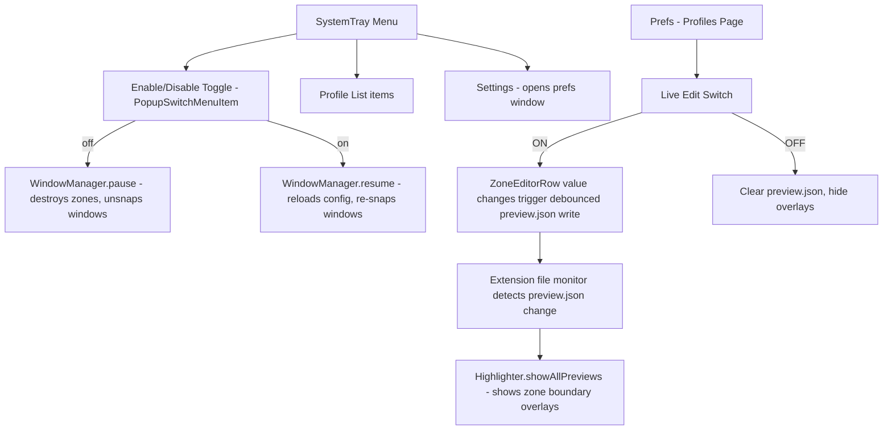
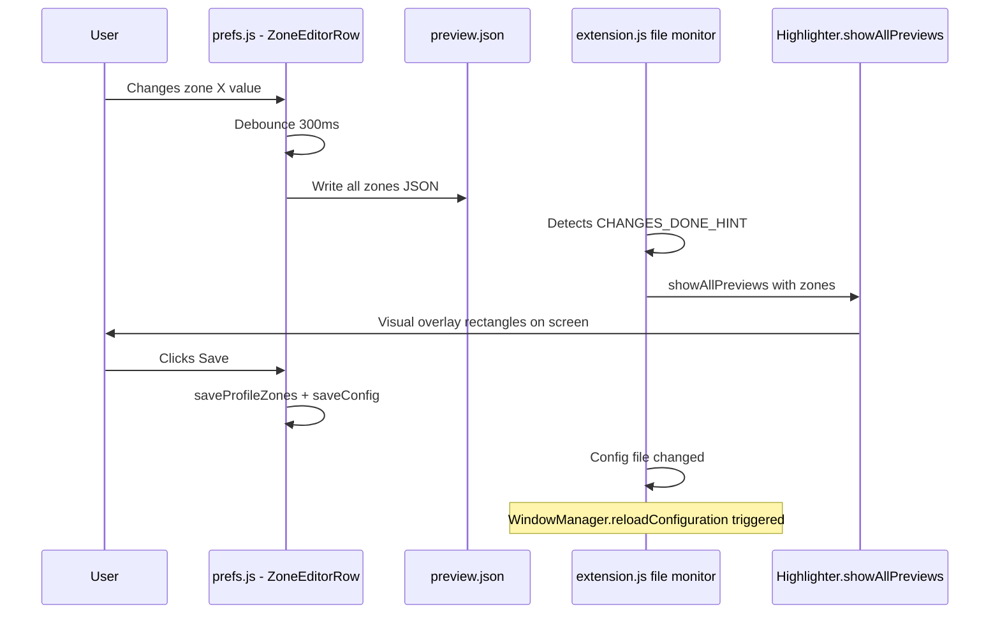

# Plan: System Tray Toggle, Settings Link & Live Edit Switch

## Overview

Three features to implement:
1. **System Tray Enable/Disable Toggle** — A switch in the tray menu that fully pauses/resumes tiling (hides tab bars, unsnaps windows).
2. **System Tray Settings Link** — A menu item that opens the extension preferences window.
3. **Live Edit Switch (Profiles page)** — A toggle on the first preferences tab that, when ON, shows real-time visual preview overlays of zone boundaries as the user edits zone values.

---

## Architecture



---

## Feature 1: System Tray Enable/Disable Toggle

### Files Modified
- `modules/SystemTray.js` — Add toggle switch and settings item
- `modules/WindowManager.js` — Add `pause()` and `resume()` methods
- `extension.js` — Track enabled state, pass callbacks to SystemTray
- `schemas/org.gnome.shell.extensions.tabbedtiling.gschema.xml` — Add `tiling-enabled` key to persist state across restarts

### SystemTray Changes

In `_buildMenu()`, add:
1. A `PopupMenu.PopupSwitchMenuItem` labeled **Enable Tiling** at the top
2. A `PopupMenu.PopupSeparatorMenuItem` separator
3. The existing profile list items
4. Another `PopupMenu.PopupSeparatorMenuItem` separator
5. A `PopupMenu.PopupMenuItem` labeled **Settings** at the bottom

```
┌─────────────────────────────┐
│ ✓ Enable Tiling       [ON]  │
├─────────────────────────────┤
│ ● Default                   │
│   Work                      │
│   Gaming                    │
├─────────────────────────────┤
│ ⚙ Settings                  │
└─────────────────────────────┘
```

### WindowManager Changes

Add two methods:

- **`pause()`** — Destroys all zones (which hides tab bars and frees windows), disconnects window tracking signals. Windows return to untiled state.
- **`resume()`** — Calls `reloadConfiguration()` and `_connectSignals()` to restore tiling from the current profile.

### Extension.js Changes

- Store an `_enabled` boolean state (persisted via GSettings key `tiling-enabled`)
- Pass an `onToggle(enabled)` callback to SystemTray constructor
- When toggled OFF: call `this._windowManager.pause()`
- When toggled ON: call `this._windowManager.resume()`

### GSchema Addition

```xml
<key name="tiling-enabled" type="b">
  <default>true</default>
  <summary>Tiling enabled</summary>
  <description>Whether the tiling behavior is active.</description>
</key>
```

---

## Feature 2: System Tray Settings Link

### Files Modified
- `modules/SystemTray.js` — Add settings menu item

### Implementation

Add a `PopupMenu.PopupMenuItem` with label **Settings** and icon `preferences-system-symbolic`. On click, launch:

```javascript
const subprocess = Gio.Subprocess.new(
    ['gnome-extensions', 'prefs', 'tabbedtiling@george.com'],
    Gio.SubprocessFlags.NONE
);
```

This opens the extension preferences window using the standard GNOME Extensions CLI.

---

## Feature 3: Live Edit Switch on Profiles Page

### Files Modified
- `prefs.js` — Add Live Edit switch, wire up debounced preview writing in ZoneEditorRow

### Implementation

#### Live Edit Switch Placement

Add an `Adw.SwitchRow` or `Adw.ActionRow` with a `Gtk.Switch` to the Zones group header area, immediately above the zone rows:

```
┌─ Zones ──────────────────────────────────────────┐
│ Description: Define rectangles for snapping...   │
│                                                  │
│ Live Edit        [toggle switch]                 │
│ Add New Zone                        [Add]        │
│                                                  │
│ ▶ Monitor 0 Zone 1    X:0, Y:0, ...             │
│ ▶ Monitor 0 Zone 2    X:960, Y:0, ...           │
└──────────────────────────────────────────────────┘
```

#### Debounced Preview Writing

When Live Edit is ON:
1. Each `ZoneEditorRow`'s spin button `value-changed` and entry `changed` callbacks should additionally call a shared `_triggerLivePreview()` function.
2. `_triggerLivePreview()` uses a debounce (e.g., 300ms via `GLib.timeout_add`) to avoid excessive file writes.
3. When the debounce fires, collect all current zone data from `zoneRows` and write to `preview.json`.
4. The running extension detects the file change via its existing `_previewFileMonitor` and calls `Highlighter.showAllPreviews(zones)`.

#### When Live Edit is OFF
- Remove any pending debounce timer
- Write an empty array to `preview.json` to clear existing overlays (or just delete the file content)
- The extension's file monitor will pick this up and the Highlighter's `showAllPreviews([])` effectively clears overlays

#### Preview Cleanup on Window Close
- When the preferences window is destroyed/closed, if Live Edit was ON, write empty preview data to clear any visible overlays.

### ZoneEditorRow Modifications

Add an optional callback parameter `onChanged` that gets called whenever any zone field changes. The parent page hooks this to the live preview writer.

```javascript
// In ZoneEditorRow constructor, accept onChanged callback
_init(zoneData, onRemove, onChanged) {
    // ... existing code ...
    // In each spin/entry callback, also call:
    if (typeof this._onChanged === 'function') this._onChanged();
}
```

---

## Data Flow: Live Edit



---

## Implementation Order

1. Add `tiling-enabled` GSchema key + recompile schemas
2. Add `pause()` / `resume()` to `WindowManager`
3. Update `SystemTray._buildMenu()` with toggle, separator, and Settings item
4. Update `extension.js` to track enabled state and pass callbacks
5. Add Live Edit switch to `prefs.js` Profiles page
6. Modify `ZoneEditorRow` to accept and call `onChanged` callback
7. Implement debounced `preview.json` writer in `prefs.js`
8. Add cleanup logic when Live Edit is toggled off or prefs window closes
9. Test end-to-end

---

## Edge Cases

- **Extension starts with tiling-enabled=false**: Extension should still load the SystemTray but skip creating zones/connecting signals.
- **Profile switch while paused**: Should update the active profile in the file but not reload zones until tiling is re-enabled.
- **Live Edit with 0 zones**: Write empty array to preview, which clears the overlay.
- **Multiple prefs windows**: Unlikely in GNOME, but the file-based approach handles it gracefully.
- **Preview timeout**: The existing `Highlighter` has a 5-second auto-hide timeout. For live edit, we should either disable the timeout or continuously re-trigger the preview while editing. Best approach: modify `showAllPreviews` to accept an optional `persistent` flag that skips the timeout.
