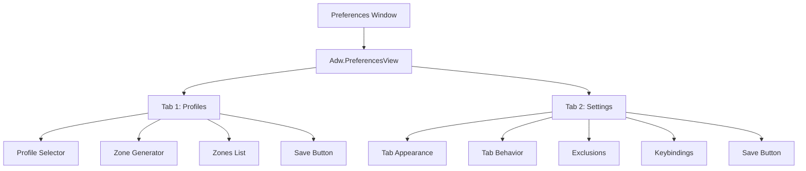

# Tabbed Preferences Window Plan

## Overview

Replace the current single-page preferences with a **two-tab layout**:
1. **Profiles Tab** - Profile management and zone configuration
2. **Settings Tab** - Global settings (tab appearance, behavior, exclusions, keybindings)

## Architecture



## Tab Structure

### Tab 1: "Profiles"
**Contains:**
1. **Profile Selector** (simple dropdown)
   - Shows all profiles
   - Checkmark on active profile
   - When profile changes, load its zones
2. **Profile Management buttons** (inline, not dialog)
   - New Profile, Rename, Delete buttons
3. **Zone Generator** section
4. **Zones** section
5. **Save Button** - Saves zones to selected profile only

### Tab 2: "Settings"
**Contains:**
1. **Tab Appearance** section
2. **Tab Behavior** section
3. **Exclusions** section
4. **Keybindings** section (read-only)
5. **Save Button** - Saves global settings only (not zones)

## Key Differences from Current Implementation

| Aspect | Current | New Design |
|--------|---------|------------|
| Layout | Single page | Two tabs |
| Profile selection | Dropdown in card | Simple dropdown row |
| Profile management | Popover dialog | Inline buttons |
| Zone loading | Per-profile | Explicit on tab switch |
| Save | Mixed (zones + global) | Separate per tab |

## Implementation Steps

### Step 1: Restructure fillPreferencesWindow
- Replace single `Adw.PreferencesPage` with `Adw.PreferencesView`
- Add two `Adw.PreferencesGroup` as tabs

### Step 2: Create Profile Tab Content
```javascript
// Profile selector row
const profileSelectorRow = new Adw.ComboRow({
    title: _('Select Profile'),
    model: profileStringList,
});

// Profile management buttons
const newBtn = new Gtk.Button({ label: _('New') });
const renameBtn = new Gtk.Button({ label: _('Rename') });
const deleteBtn = new Gtk.Button({ label: _('Delete') });

// Zone Generator, Zones list, Save button
```

### Step 3: Create Settings Tab Content
- Move existing tabBarGroup, behaviorGroup, exclusionsGroup, keybindingsGroup to this tab
- Add own Save button that only saves global config

### Step 4: Handle Profile Switching
- On profile selection change:
  1. Load zones from `~/.config/tabbedtiling/profiles/[profile]/zones.json`
  2. Clear and rebuild zone rows
  3. Update context display

### Step 5: Separate Save Logic
- **Profiles tab Save**: Save zones to active profile's `zones.json`
- **Settings tab Save**: Save global config to `config.json` (tabBar, exclusions, etc.)

## File Changes

### prefs.js - fillPreferencesWindow method

```
OLD (single page):
page.add(profilesGroup)
page.add(contextBannerGroup)
page.add(generatorGroup)
page.add(zonesGroup)
page.add(tabBarGroup)
page.add(behaviorGroup)
page.add(exclusionsGroup)
page.add(keybindingsGroup)
page.add(actionsGroup)

NEW (two tabs):
view.add_tab(page1)  // Profiles
view.add_tab(page2)  // Settings
```

## Benefits

1. **Clearer separation** - Profiles vs Settings are distinct concerns
2. **Simpler profile selector** - No complex card needed, just a combo row
3. **No dialog issues** - Profile management is inline, no popover problems
4. **Explicit save** - Each tab saves its own domain (zones vs settings)
5. **Better UX** - Users understand they need to save per-tab